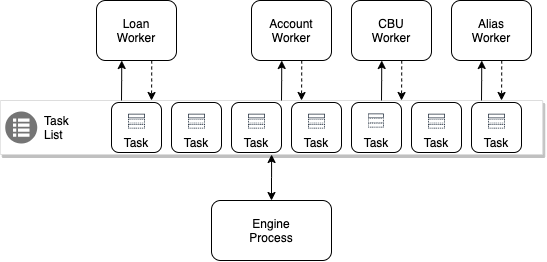
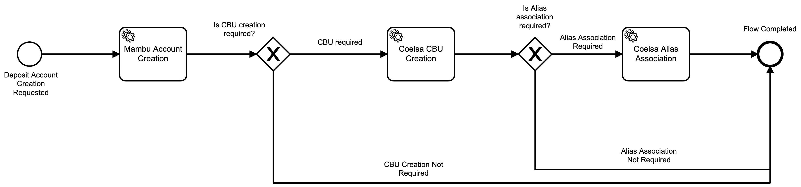
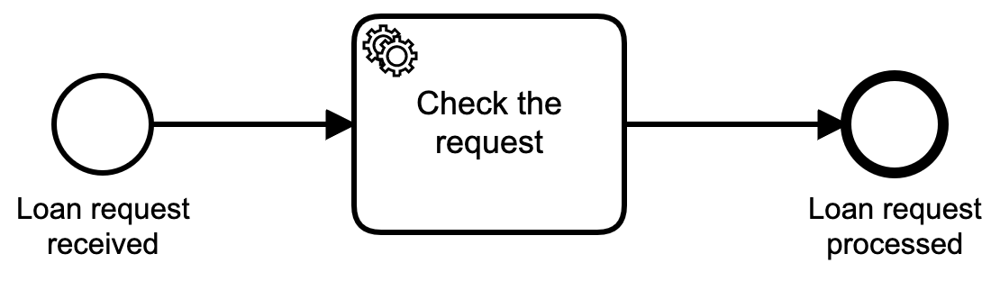

# Summary
Enfoque **asincronico** donde las [Service tasks](https://docs.camunda.org/manual/latest/reference/bpmn20/tasks/service-task/) y el [Process Engine](https://docs.camunda.org/manual/7.9/user-guide/process-engine/process-engine-concepts/) ejecutan sobre procesos separados. 

Por cada **Service task** dentro de un workflow, el engine creara un *work item* para que sea tomado por un worker (pull), quien sera el encargado de implementar la logica relacionada a la tarea (ver [External Task Pattern](https://docs.camunda.org/manual/7.7/user-guide/process-engine/external-tasks/#the-external-task-pattern)). 

 


## Engine Process

Bajo este *approach*, el **Engine Process** opera en modo **no-bloqueante**. Es decir que el engine no se bloqueara cada vez que una **Service task** necesite ser ejecutada, evitando asi los tiempos muertos y logrando un mejor aprovechamiento de los recursos.


## Deposit Account Creation Workflow
 [Workflow](process-engine/src/main/resources/depositAccountCreation.bpmn) que simula el proceso de creacion de cuenta y consta de tres tareas:

1. [Account Creation](account-worker/src/main/java/com/demo/camunda/externaltask/worker/ScheduledAccountWorker.java): creacion de cuenta.
2. [CBU Creation](cbu-worker/src/main/java/com/demo/camunda/externaltask/CbuWorkerApplication.java): creacion de CBU.
3. [Alias Association](alias-worker/src/main/java/com/demo/camunda/externaltask/AliasWorkerApplication.java): ***Long-Running task*** para la asociacion de alias. 

## Loan Approval Workflow


[Simple workflow](process-engine/src/main/resources/loanApproval.bpmn) que simula la revision de un pedido de prestamo. Consta de una tarea:

1. [Check Request](loan-worker/src/main/java/com/demo/camunda/externaltask/LoanWorkerApplication.java): chequea el pedido de prestamo

## Process Runner Schedule Service
[Servicio](process-engine/src/main/java/com/demo/camunda/externaltask/service/ProcessRunnerScheduleService.java) encargado de crear instancias de [Deposit Account Creation Workflow](#deposit-account-creation-workflow) y [Loan Approval Workflow](#loan-approval-workflow) en intervalos de tiempo constante definido por: 

```yaml
scheduler:
  fixedRate: 500
  initialDelay: 60000
```
## Run

```zsh
$ docker-compose up -d
```
Output Logs:

```zsh
...
process-engine_1  | 2020-06-09 19:10:26.344  ... ProcessRunnerScheduleService   : Starting new accountCreationProcess with id e047ace5-aa84-11ea-a1d2-0242ac170002
process-engine_1  | 2020-06-09 19:10:26.348  ... ProcessRunnerScheduleService   : Starting new loanApproval with id e048492b-aa84-11ea-a1d2-0242ac170002
account-worker_1  | 2020-06-09 19:10:26.353  ... ScheduledAccountWorker         : Creating account ~ e047ace5-aa84-11ea-a1d2-0242ac170002
loan-worker_1     | 2020-06-09 19:10:26.356  ... LoanWorkerApplication          : Check loan request ~ e048492b-aa84-11ea-a1d2-0242ac170002
cbu-worker_1      | 2020-06-09 19:10:26.364  ... CbuWorkerApplication           : Creating CBU ~ e047ace5-aa84-11ea-a1d2-0242ac170002
alias-worker_1    | 2020-06-09 19:10:26.736  ... AliasWorkerApplication         : Association Alias ~ 9a53ce67-aa84-11ea-a1d2-0242ac170002
alias-worker_1    | 2020-06-09 19:10:26.747  ... AliasWorkerApplication         : Sleeping task of account workflow...zzzz
process-engine_1  | 2020-06-09 19:10:26.845  ... ProcessRunnerScheduleService   : Starting new accountCreationProcess with id e0941f57-aa84-11ea-a1d2-0242ac170002
process-engine_1  | 2020-06-09 19:10:26.848  ... ProcessRunnerScheduleService   : Starting new loanApproval with id e0946d7d-aa84-11ea-a1d2-0242ac170002
...
```

* Camunda Web Console: http://localhost:8080/

* H2 Data Base Console: http://localhost:8080/h2-console/


Existe un [set de pruebas](assets/camunda-history-report.postman_collection.json) para ver los tiempos promedio de ejecucion de cada instancia de workflow.

## Referencias
* [Docs Camunda](https://docs.camunda.org/manual/latest/)